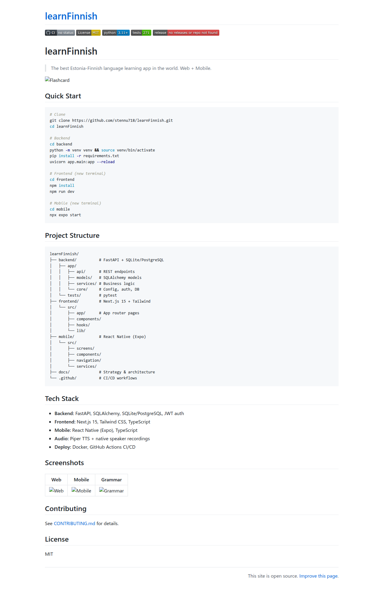

[](https://github.com/stennu718/learnFinnish/actions/workflows/ci.yml)
[](https://opensource.org/licenses/MIT)
[](https://www.python.org/downloads/)
[]()

# learnFinnish

> The best Estonia-Finnish language learning app in the world. Web + Mobile.

## Quick Start

```bash
# Clone
git clone https://github.com/stennu718/learnFinnish.git
cd learnFinnish

# Backend
cd backend
python -m venv venv && source venv/bin/activate
pip install -r requirements.txt
uvicorn app.main:app --reload

# Frontend (new terminal)
cd frontend
npm install
npm run dev

# Mobile (new terminal)
cd mobile
npx expo start
```

## Project Structure

```
learnFinnish/
├── backend/          # FastAPI + SQLite/PostgreSQL
│   ├── app/
│   │   ├── api/      # REST endpoints
│   │   ├── models/   # SQLAlchemy models
│   │   ├── services/ # Business logic
│   │   └── core/     # Config, auth, DB
│   └── tests/        # pytest
├── frontend/         # Next.js 15 + Tailwind
│   └── src/
│       ├── app/      # App router pages
│       ├── components/
│       ├── hooks/
│       └── lib/
├── mobile/           # React Native (Expo)
│   └── src/
│       ├── screens/
│       ├── components/
│       ├── navigation/
│       └── services/
├── docs/             # Strategy & architecture
└── .github/          # CI/CD workflows
```

## Tech Stack

- **Backend:** FastAPI, SQLAlchemy, SQLite/PostgreSQL, JWT auth
- **Frontend:** Next.js 15, Tailwind CSS, TypeScript
- **Mobile:** React Native (Expo), TypeScript
- **Audio:** Piper TTS + native speaker recordings
- **Deploy:** Docker, GitHub Actions CI/CD

## Screenshots

| Web | Mobile | Grammar |
|-----|--------|---------|
|  |  |  |

## Contributing

See [CONTRIBUTING.md](CONTRIBUTING.md) for details.

## License

MIT
